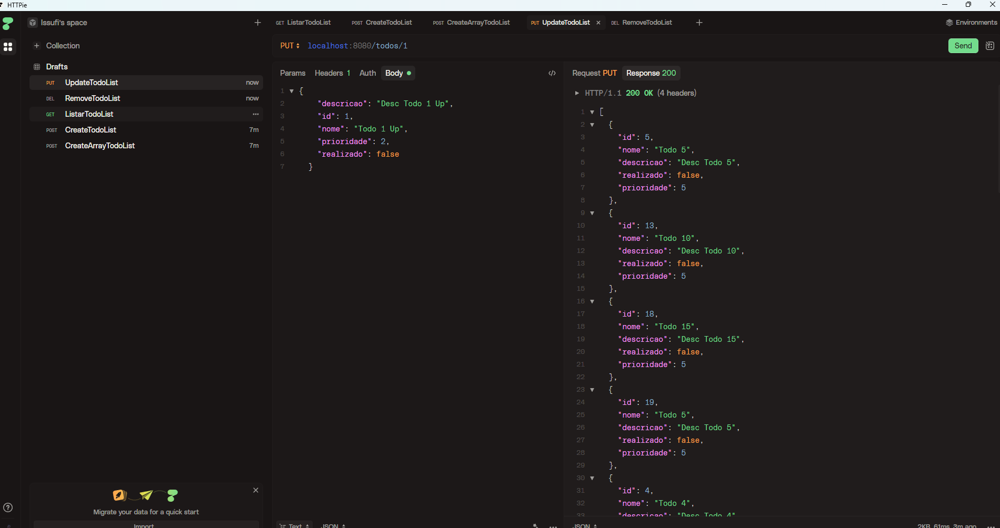
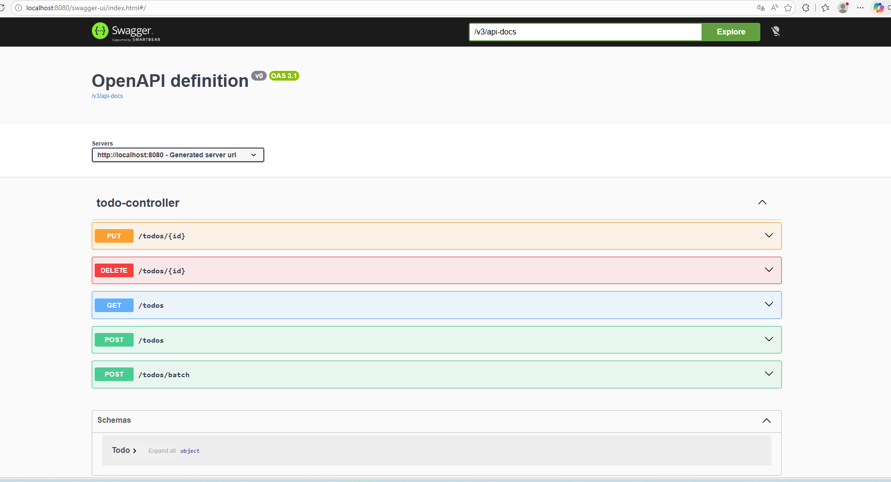

<h1 align="center">
  TODO List
</h1>

<p align="center">
<a src="https://github.com/issufibadji/todolist-springboot">
 </a>
<a src="">
 </a>
</p>

API para gerenciar tarefas (CRUD) que faz parte [desse desafio](https://github.com/simplify-liferay/desafio-junior-backend-simplify) para pessoas desenvolvedoras backend júnior, que se candidatam para a Simplify.


## Tecnologias
 
- [Spring Boot](https://spring.io/projects/spring-boot)
- [Spring MVC](https://docs.spring.io/spring-framework/reference/web/webmvc.html)
- [Spring Data JPA](https://spring.io/projects/spring-data-jpa)
- [SpringDoc OpenAPI 3](https://springdoc.org/v2/#spring-webflux-support)
- [Mysql](https://dev.mysql.com/downloads/)

## Práticas adotadas

- SOLID, DRY, YAGNI, KISS
- API REST
- Consultas com Spring Data JPA
- Injeção de Dependências
- Tratamento de respostas de erro
- Geração automática do Swagger com a OpenAPI 3

## Como Executar

- Clonar repositório git
- Construir o projeto:
```
$ ./mvnw clean package
```
OU
```
$env:JAVA_HOME = "C:\Program Files\Java\jdk-26.0.1"
.\mvnw clean package
```

- Executar a aplicação:
```
$ java -jar target/todolist-0.0.1-SNAPSHOT.jar
```

A API poderá ser acessada em [localhost:8080](http://localhost:8080).
O Swagger poderá ser visualizado em [localhost:8080/swagger-ui.html](http://localhost:8080/swagger-ui.html)

## API Endpoints

Para fazer as requisições HTTP abaixo, foi utilizada a ferramenta [httpie](https://httpie.io):

- Criar Tarefa 
```
$ http POST :8080/todos nome="Todo 1" descricao="Desc Todo 1" prioridade=1

[
  {
    "descricao": "Desc Todo 1",
    "id": 1,
    "nome": "Todo 1",
    "prioridade": 1,
    "realizado": false
  }
]

$ http POST :8080/todos nome="Todo 2" descricao="Desc Todo 2" prioridade=2

[
  {
    "descricao": "Desc Todo 2",
    "id": 2,
    "nome": "Todo 2",
    "prioridade": 2,
    "realizado": false
  }
]
```

- Listar Tarefas
```
$ http GET :8080/todos

[
  {
    "descricao": "Desc Todo 1",
    "id": 1,
    "nome": "Todo 1",
    "prioridade": 1,
    "realizado": false
  }
]
```

- Atualizar Tarefa
```
$ http PUT :8080/todos/1 nome="Todo 1 Up" descricao="Desc Todo 1 Up" prioridade=2

[
  {
    "descricao": "Desc Todo 1 Up",
    "id": 1,
    "nome": "Todo 1 Up",
    "prioridade": 2,
    "realizado": false
  }
]
```

- Remover Tarefa
```
http DELETE :8080/todos/1

[ ]
```

- Criar Múltiplas Tarefas (batch)

```
$ http POST :8080/todos/batch \
  '[{"nome":"Todo 6","descricao":"Desc Todo 6","prioridade":1},{"nome":"Todo 7","descricao":"Desc Todo 7","prioridade":2}]'

[
  {
    "descricao": "Desc Todo 7",
    "id": 2,
    "nome": "Todo 7",
    "prioridade": 2,
    "realizado": false
  },
  {
    "descricao": "Desc Todo 6",
    "id": 1,
    "nome": "Todo 6",
    "prioridade": 1,
    "realizado": false
  }
]
```

## Demo

### HTTPie



### Swagger UI



## Documentação completa

Consulte o diretório [docs/](docs/index.md) para documentação detalhada sobre arquitetura, banco de dados, testes e deploy.